<!--- # Introduction --->

!!! note "The latest version can always be found here: https://pages.github.ibm.com/IBM-Cloud-Satellite-and-PaaS-Community/cobaltiron-demo-oict/"

<!--- [Download the latest (PDF)](pdf/rhoai-demo-oict.pdf){ .md-button } [Download the latest (DOCX)](out/rhoai-demo-oict.docx){ .md-button } --->

# Backup PowerVS worklaods using Backup-as-a-Service With Cobalt Iron Compass - Demo Script

  

***Notes to sellers and tech sellers:***

1. This narrative uses an example customer scenario.
2. This demo script assumes that you are presenting to the customer based on your previous conversation and recapping issues and concerns shared by the customer
3. Feel free to tailr the demo script based on the customer AI adoption maturity and identify relevant demo to show such as Red Hat OpenShift AI, RHEL AI or Watsonx services from [AI on Cloud demos in Techzone](https://techzone.ibm.com/collection/IBMCloudTechDemos/journey-ai-on-ibm-cloud). If you dont find what you need please reach out to the [contacts](https://pages.github.ibm.com/IBM-Cloud-Satellite-and-PaaS-Community/rhoai-demo-oict/#contacts) in the demo script.

### Use case

Expand on existing AI/ML to build Gen AI applications and manage lifecycle of AI models in dev, test and production consistently.

### Customer scenario

Sr.VP Operations of a large consumer company is looking to shut down a data center which is being held for two years to support only Power systems supporting two of the business units. But his business unit leaders are concerned with data retention compliance, data protection post migration and DR test to meet auditory requirements for business continuity.

IBM’er: Based on our meeting last week with you, if I may recall our conversation, you have one data center in particular which you are looking to shut down but concerned about critical workloads running on Power systems supporting two of your business units. I recall you are willing to migrate these Power workloads to Power Virtual Servers (PowerVS) on IBM Cloud, if the concerns of your business units are addressed:
•	Unique Data retention policy for each of the business units
•	Ability to restore on demand in case of loss of data or as needed to support users
•	Meet data backup/restore policies unique to each of those departments.
•	Meet twice a year DR test requirements to assure your auditors on the business continuity strategy.

You are also concerned about moving to another backup solution moving away from Spectrum Protect solution that you have been using for years.

### IBM Solution
I am excited to come back to you today to show you that we have a partner solution ‘Cobalt Iron Compass solution’ hosted on IBM Cloud as Backup-as-a-Service, that addresses all of your concerns with backup, restore, data retention and meet your DR test requirements.

Cobalt Iron Compass is the only automated, secure Backup-as-a-Service (BaaS) for Power VS workloads running AIX and Linux, powered by IBM Storage Protect and key highlights are:

•	It simplifies and secures the backup and recovery of AIX, Linux, Oracle on AIX, Db2 on AIX, and SAP HANA on Linux 
•	Offers instant setup and hands-free operations from a single unified solution.  
•	Compass is the premiere data protection solution for many PowerVS workloads.  
•	Compass has been deeply integrated with and optimized for the IBM Cloud.
•	Provides a comprehensive Audit Framework that enables customers to govern their backup environment and operations according to their internal processes and requirements. 

Cobalt Iron itself complies with stringent laws, policies, and procedures, and is SOC2 certification compliant, proving by third party validation and penetration testing the high levels of information security practiced. Compass also meets the stringent Sheltered Harbor Vaulting requirements for financial organizations and has a Sheltered Harbor endorsed option.

**Proven value:**
The following diagram shows an overview of the data protection and resilience provided by the Compass Secure Automated Backup solution.  
•	The customer’s PowerVS workspaces, PowerVS instances, and their workloads, are securely connected through corporate cloud networking to the Compass Vaults in IBM Cloud regions or in client locations (for PowerVS PC deployments).

•	Second copies of backup data are automatically made to a replication-paired Compass Vault in another cloud region or in another client location (for PowerVS PC deployments)

•	On-premises Power workloads or PowerVS Private Cloud workloads can be backed up to either in-cloud Compass Vaults or to on-premises Compass Vaults.

  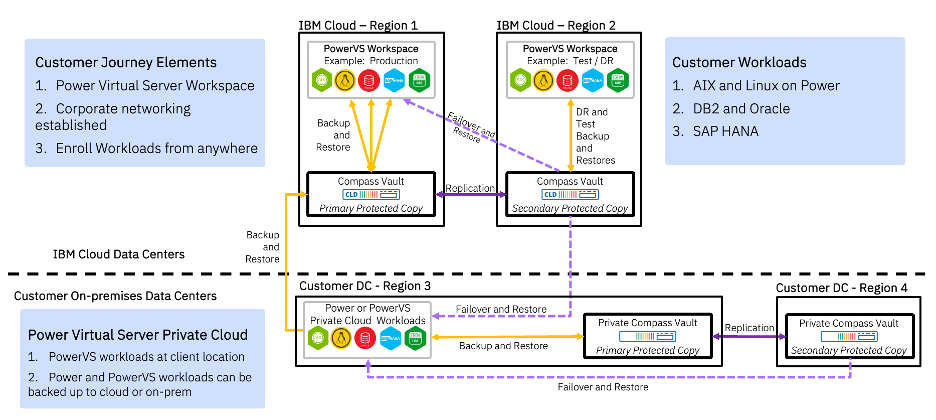

Above picture assures on following outcomes  using Compass from Cobalt Iron:
1.	Backup PowerVS instances in any Region of your choice on IBM Cloud
2.	Backup Power systems in your Data center to prepare for migration and support post migration data recovery needs and data retention policies
3.	With data backup stored in Vaults across multiple regions, supports the need for DR testing for systems, applications including databases.

A few things to note:
1.	To back up AIX or Linux workloads in PowerVS workspace in cloud, the BaaS VPC and the Power Virtual Server workspaces are required to be present in the same region and connected by using the local Transit Gateway. Compass automation creates these connections when the Compass service is created from the IBM Cloud Catalog.
2.	Data are backed up to the Compass backup vault servers in two separate regions for added resiliency.
3.	Multiple LPARs in PowerVS workspace can use the same secure backup servers. For LPARs in the second backup server site, VPE may need to be created.

Today I am going to show you on how to achieve ***outcome #1***

### Demo steps

Here are steps I follow in the demo today and happy dive deep into any area you like to spend time on:

1.	Leverage IBM Cloud Deployable Architectures to speed provisioning of PowerVS instances, networking and other cloud service needed to support the migration
2.	Provision Cobalt Iron Compass Backup-as-a-Service on IBM Cloud
3.	Perform backup of critical files and MySQL database to show an example
4.	Restore choice of files from the backup version
5.	Restore MySQL database

For the purpose of this demo, I have pre-provisioned all cloud services and Compass to build the demo environment and I am going to show you what I pre-provisioned before I dive into how I backup and restore PowerVS using Cobalt Iron Compass.

NOTE: Please refer to ***APPENDIX*** for detailed steps to build the demo environment. 

**Leverage PowerVS Deployable Architecture**

IBM Cloud deployable architecture is cloud automation for deploying a common architectural pattern that combines one or more cloud resources. It offers a modular, flexible foundation for businesses to build, deploy, and manage applications securely in the cloud. IBM Cloud offers a few different flavors of deployable architectures that provide an automated deployment method to create an isolated Power Virtual Server workspace and connect it with IBM Cloud services and public internet. 

In this demo, we will create a simple quick start environment for quick testing. For more information on the various Power Virtual Server deployable architectures, refer to Power Systems Virtual Server with VPC landing zone documentation page.

1. Login to IBM Cloud and go to Cloud Catalog

2. Search for ‘Power Virtual Server with VPC landing zone’ in the Catalog.
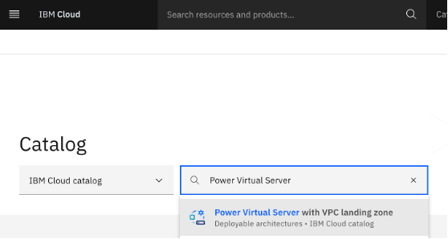

3. PowerVS deployable architecture offers two variations Standard and QuickStart. Standard allows you to create the workspace and all relevant Networking that enables you to create as many PowerVS instances needed and also extend the architecture in future.
QuickStart variations deploys the architecture and also provisions one PowerVS instance for you to experience end to end provisioning  flow. 

4. Use PowerVS Quickstart deployable architecture (DA) to create a new architecture. You can set up PowerVS instance with AIX, IBM i, Linux, or SAP. In this demo, we will set up a new architecture with RHEL 9.2 on PowerVS instance. Detailed instructions can be found in IBM Cloud docs.

5.	As you can see from the deployable architecture diagram, it creates Edge VPC and PowerVS workspace. In Edge VPC, it creates Bastion host (jump server) in management security group, and proxy server in network service security group. It also creates a PowerVS instance in the PowerVS workspace with RHEL 9.2. Other necessary components to connect PowerVS workspace with IBM Cloud resources and secure the environment are also created, for example, Transit Gateway, VPN, VPE, etc.

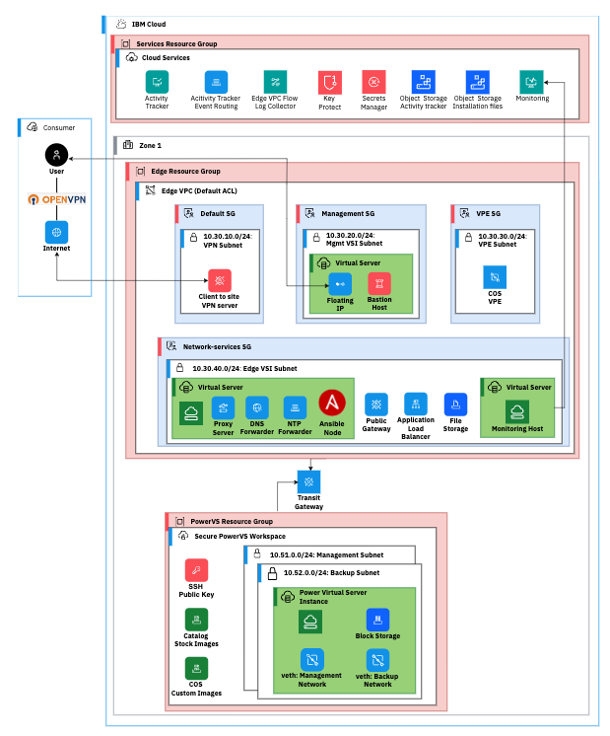

6. Click on Permissions and Security and Compliance tabs and explain those two tabs.

7. Add to an existing project. 
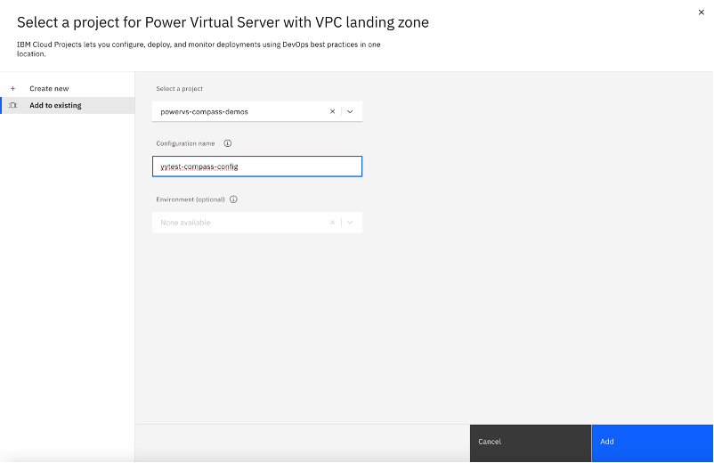

8. Let’s create a Linux virtual server with RHEL 9.2 image. We can choose custom image for ‘tshirt_size’ and choose ‘Linux -RHEL9-SP2’ for ‘custom_profile_instance_boot_image’ under optional parameters. For ‘custom_profile’ field, here is the sample input for a small virtual server, you can adjust the input based on your requirements.
{
  "sap_profile_id": null,
  "cores": "1",
  "memory": "2",
  "server_type": "s922",
  "proc_type": "shared",
  "storage": {
    "size": "",
    "tier": ""
  }
}

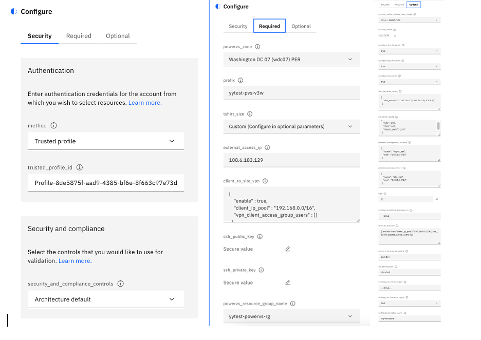

9. Save and validate the configuration. Approve and deploy. The environment will be deployed automatically. 

**Workload setup**

1.	Now that I have my PowerVS instance provisioned on IBM Cloud, you can start deploying your workloads such as Databases as needed
2.	For the purpose of this demo, I deployed deploy MySQL server. You can install MySQL on RHEL 9.x by following instructions on this Red Hat documentation page. 
3.	I am going to demonstrate to you how I backup important files and MySQL Database using Cobalt Iron Compass and also restore.

For some databases, for example, Oracle, Compass integrates with the database via RMAN and you need to run another installer on the virtual server. For MySQL, user could backup the database into a file, for example:
o	Backup MySQL locally
mysqldump -p <database_name > <backup_file.sql>

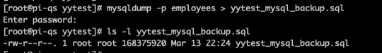

4. Now we have the PowerVS instance and some sample data ready, we can start the backup.

**Compass backup operations**

Cobalt Iron Compass supports all of the systems and applications that IBM Storage Protect does plus many additional ones.  Compass allows consistent management of diverse workloads across on-premises and various cloud platforms through a consolidated management experience.  Compass platform support includes:
-	Systems: AIX (back to 7.1), HP-UX, Linux on Power (SLES and RHEL), Linux on Power Little Endian (SLES, RHEL, Ubuntu), Linux x86_64 (SLES, RHEL, Ubuntu), Linux on Z, MacOS, Solaris, Windows (back to 2012)
-	Databases: SQL, Oracle, Db2, Informix, MongoDB, MySQL, MariaDB, Sybase, and others
-	SAP, SAP HANA
-	Email:  Exchange, HCL Domino
-	IBM Storage Scale/GPFS
-	Virtualization platforms:  VMware, Hyper-V
-	NAS:  NetApp, Isilon, Windows File Servers, most NAS devices
-	Containers:  OpenShift, Kubernetes (via technology plug-in)
-	Cloud applications:  MS365 (via technology plug-in), AWS services, Azure SQL and other Azure services, Google services, etc. 

In this demo, let’s set up backup for Linux on PowerVS in this demo.

**Provision Cobalt Iron Compass service:**

1.	Though I have already provisioned, let me show yo how you can provision Cobalt Iron Compass service in your Cloud account.

2.	Login to IBM Cloud, and search Cobalt in the catalog.
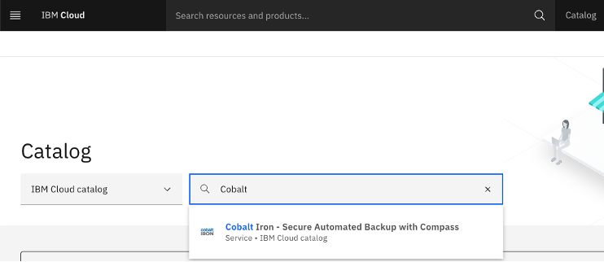

3. Fill in the information and provision the service.
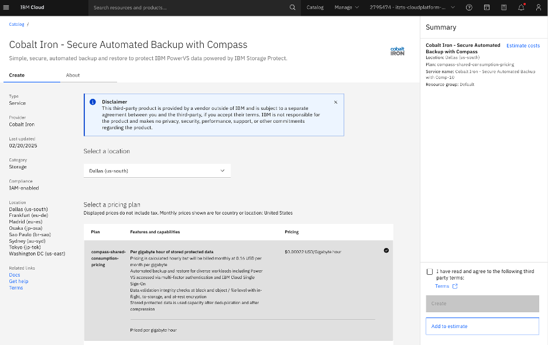

4.	Creating a System in Compass Commander

Refer to instructions [**here**](https://help.cobaltiron.com/wp-content/uploads/2024/01/CobaltIron-PowerVS-AgentSetup-Linux-20240326.pdf) for how to set up backup for Linux on PowerVS.

5. Login to IBM Cloud, in Resource list, look for compass under Product.
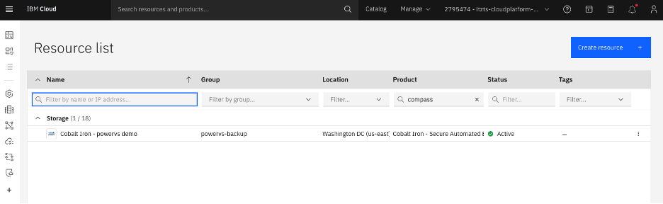

6. Click on the Compass instance, and ‘Launch Commander’.
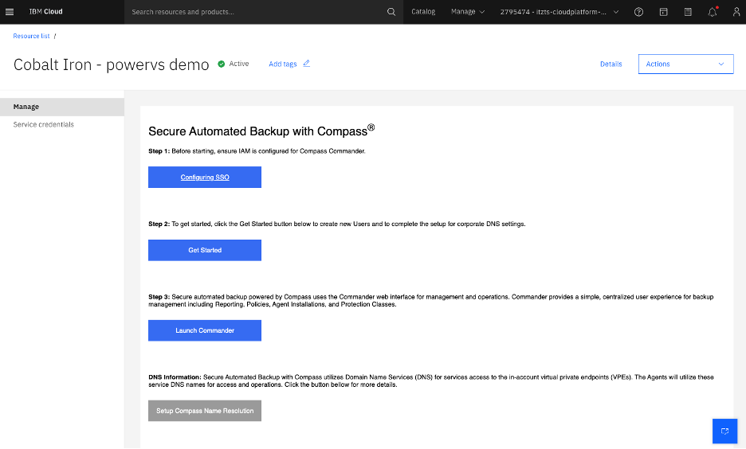

7. We need to create a system in Commander. On the Commander Systems tab, click + to create a system.
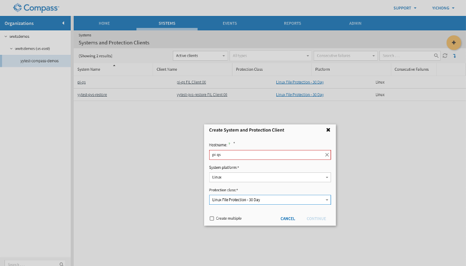

8. Click on Continue, and the system is created as well as the Protection Client for filesystem backups. The server is now enrolled for backups.

5.	Click on the system name:
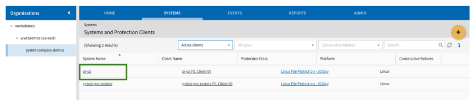

6.	And click on the client name under Protection Clients.
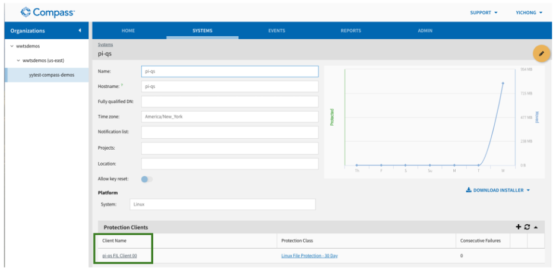

7.	Find client identifier on the details tab.
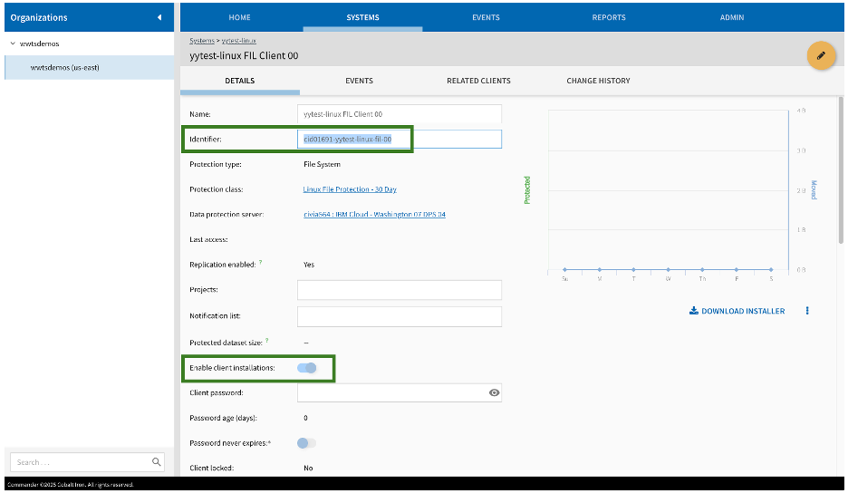

Note that the “Enable agent installations” option for this protection client in Commander should be enabled by default, if not, enable it.

8.	Find your client identifier and record it.
    - Client name: pi-qs FIL Client 00
    - Client identifier: cid01744-pi-qs-fil-00

9.	Installing and Configuring Agent Components. On the details tab, you can also find ‘DOWNLOAD INSTALLER’ button, and download the installer for RHEL for Power.
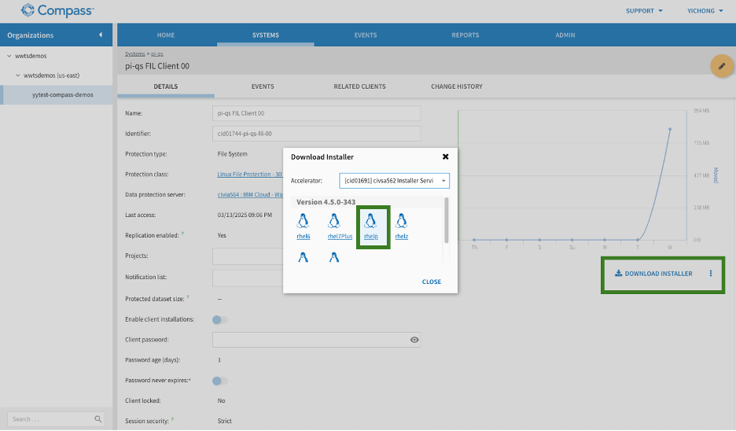

10. File name example: ci_agent_cid01744_rhelp-4.5.0-343.sh

Copy the file to Linux PowerVS instance.
  PRIVATE_KEY_FILE=/path-to-your-private-key-file
scp -i $PRIVATE_KEY_FILE -J root@pvs_compass_jumpserver <installer-file> root@$PVS_SERVER_IP:/remote-path-to/<installer-file>
For example,
scp -i $PRIVATE_KEY_FILE -J root@pvs_compass_jumpserver ~/Downloads/ci_agent_cid01691_rhelp-4.5.0-343.sh root@$PVS_SERVER_IP:/root/ci_agent_cid01691_rhelp-4.5.0-343.sh

Make the file executable:
  chmod u+x ci_agent_cid01691_rhelp-4.5.0-343.sh

Perform agent install:
  ./ci_agent_cid01691_rhelp-4.5.0-343.sh  install
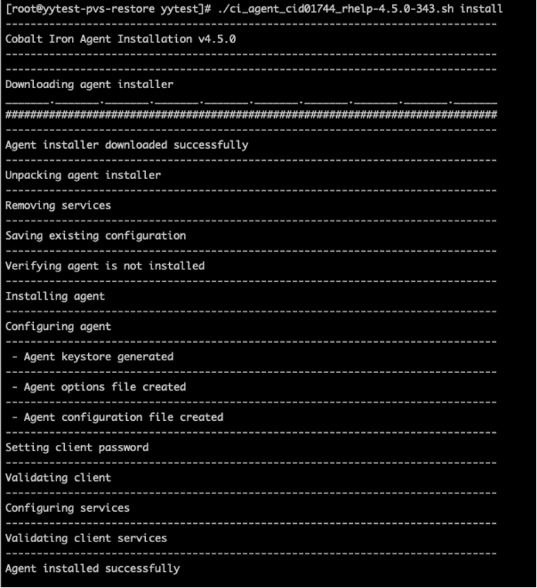

11. When you inspect the system on Commander dashboard, you can see the backup schedule for the system.
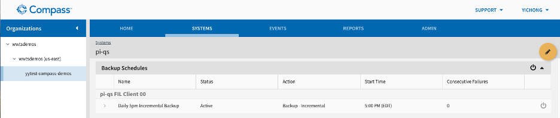

12. You can either wait for the scheduled backup to happen, or you can use IBM Storage Protect BACLIENT interactive command line to do backup. The command is dsmc. Refer to this IBM site for more information in chapter 11: https://www.ibm.com/docs/en/SSEQVQ_8.1.19/pdf/b_ba_guide_unx_lnx.pdf

  - Query the schedule.
  - dsmc q sched
  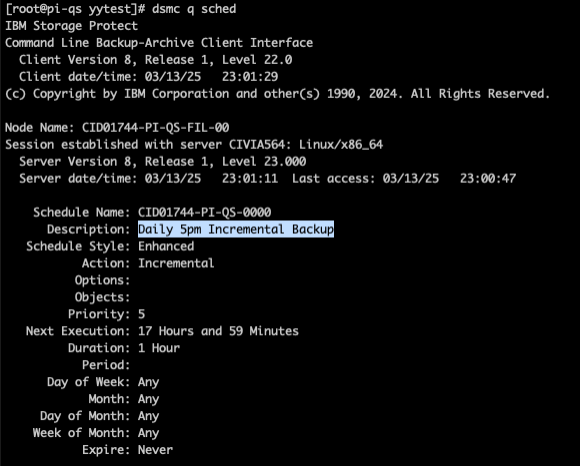

13. Do incremental back of my directory.
  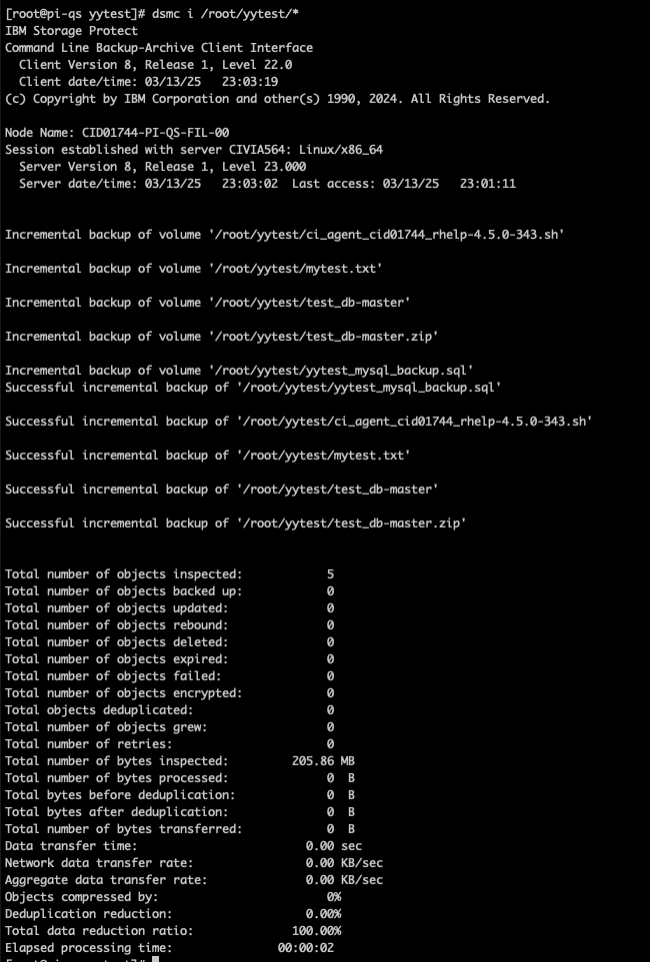

**3.4	Backup validation**

1.	On Compass Commander dashboard, under Systems tab, click on the system name, and you should be able to see the Protection Client Events. 
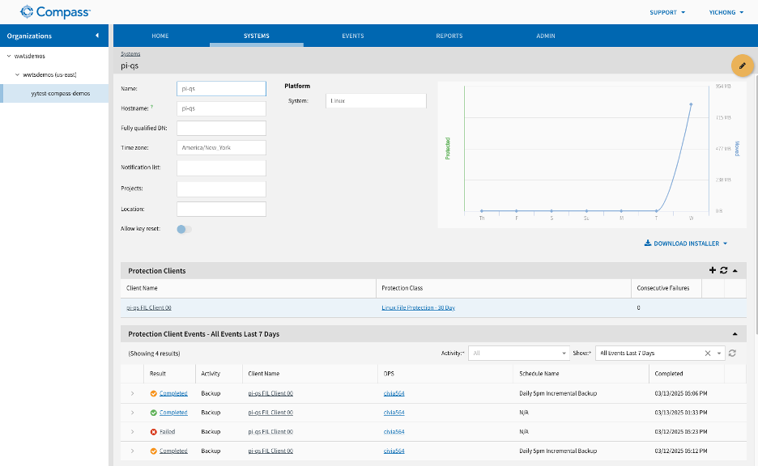

2. You can also click on EVENTS tab, and inspect the SUMMARY and DETAILS tabs.
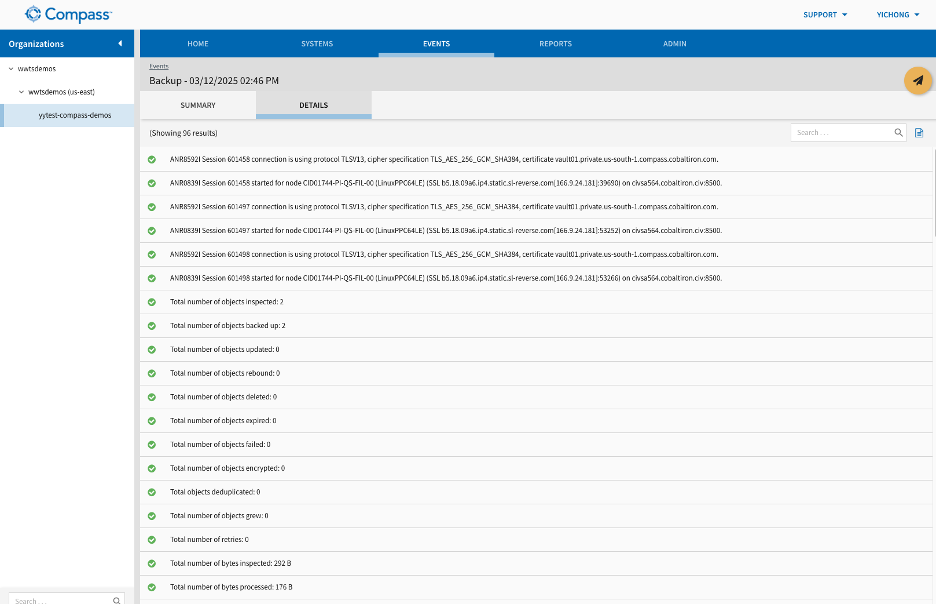

**Restore PowerVS environment**

Secure backup is essential not only for business continuity but also for supporting an effective cloud strategy. By creating secure, encrypted backups, businesses can safely migrate workloads, test cloud environments, and ensure data redundancy across hybrid and multi-cloud setups. Secure backups provide a reliable foundation for scaling operations to the cloud, as they allow data to be restored or replicated in different cloud regions or providers, ensuring resilience and flexibility. This approach not only safeguards against data loss but also facilitates cloud adoption, enabling seamless data mobility, regulatory compliance, and risk management as companies expand their cloud infrastructure.

As highlighted in the following figure, the backup images can be used to restore an environment in cloud. As discussed in section 3.1.2, as enterprises start to embrace cloud strategy, they can rapidly provision a dev/test environment in cloud when needed to take advantage of cloud without impacting critical production systems. This would also bring cost advantages to provision the environment with the right sizing only when needed.
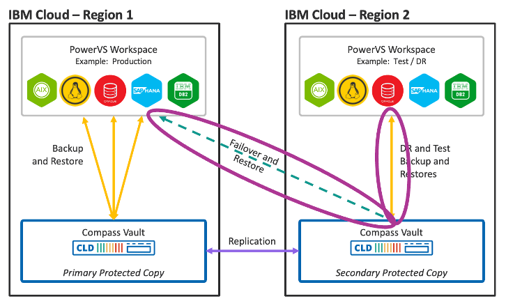

In this demo, you can use the PowerVS DA to provision a new environment or manually create a PowerVS instance as the restore environment. 

If you provision a new environment, make sure to add the backup VPC to the transit gateway to make sure that it has connectivity to the Compass vaults. Click on the Hamburg menu on the upper left, and find Transit Gateway. Click on the transit gateway of the restore environment, and add compass VPC if it is not there.

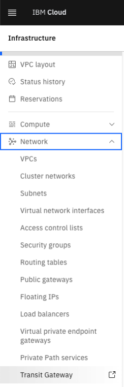

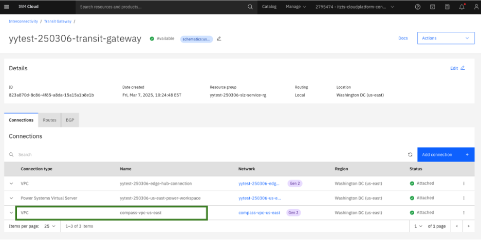

We can login to the PowerVS instance to start the restore. The assumption is that provisioning tool will set up the environment and install necessary softwares, and Compass will backup and restore client data.

In my demo, I run the following command to install and start the MySQL server.
	dnf install mysql-server
	systemctl start mysqld.service

If your new system has the same hostname as before, you can go to the Commander dashboard, and make sure to enable the client installation.
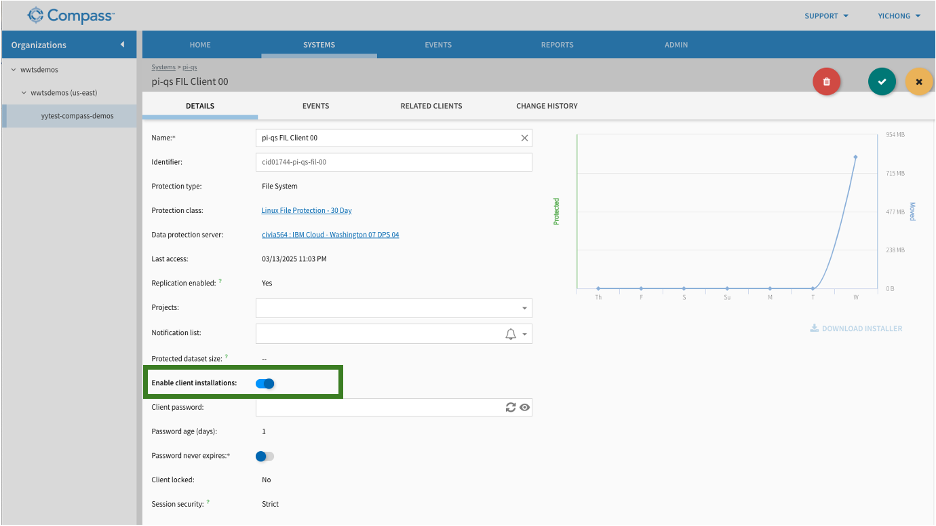

If your new system has different hostname from before, you need to go to the Commander dashboard and register the new system. The enable client installation should be enabled when you just register the system. 

Run the installer on the server.
	./ci_agent_cid01744_rhelp-4.5.0-343.sh install

Now let’s restore the data in my user directory /root/yytest.

If the hostname of the recover server is different from before, you need to tell it to pick up the backup data from the previous server. You can update the configuration file for the Storage Protect.
- cd /opt/tivoli/tsm/client/ba/bin/
- add to the end of the file dsm.sys
ASNODENAME           <old-client-id> 
    For example,
      ASNODENAME           cid01744-pi-qs-fil-00

- You can also run dsmc command with parameter to run as a different node for the current session, for example,
dsmc -asnode=CID01744-pi-qs-FIL-00

- You can check the timestamp of the backup before a given date and time inside dsmc shell
q ba -pitt=17:00:00 -pitd=03/13/25 "/root/yytest/*"

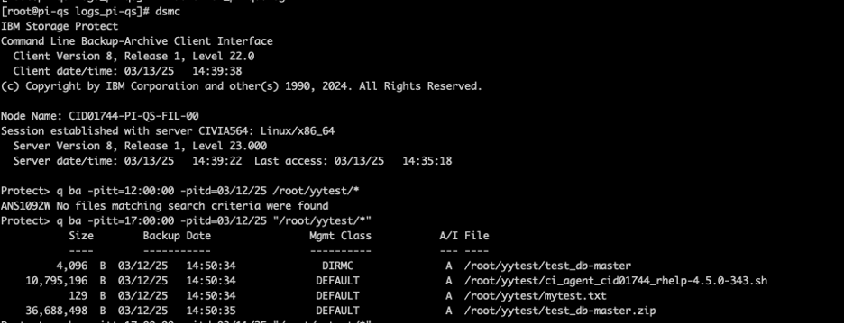

- You can pick which file you would like to restore in dsmc shell:
restore /root/yytest/* -pick
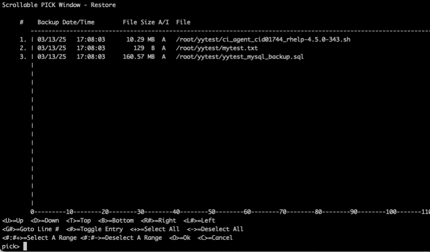

- Or you can restore the directory inside dsmc shell
restore /root/yytest/*

Now I got the files I had before back:
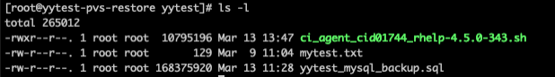

### Demo summary

As I have shown, PowerVS and Cobalt Iron Compass Backup-as-a-Service hosted on IBM Cloud address specific concerns you have as recapped below:
•	Unique Data retention policy for each of the business units
•	Ability to restore on demand in case of loss of data or as needed to support users
•	Meet data backup/restore policies unique to each of those departments.
•	Meet twice a year DR test requirements to assure your auditors on the business continuity strategy.

As a next step, we are excited to work with you to setup a Pilot project to migrate couple of your Power workloads and setup backup policies so you can experience the same in real time to feel confident to begin migration to IBM Cloud.

### Do It Yourself

Prerequisites to Secure backup from on-premises to IBM cloud:

1.1 Log in to IBM Cloud and provision Secure Automated Backup with Compass from IBM Cloud catalog.
1.2 Set up secure network connection between on-premises to IBM Cloud, via VPN or Direct Link.
1.3 Enroll systems and applications to be protected on Compass Commander UI (“SYSTEMS” tab) and enable the backup.
1.4. Install compass agent if needed and configure VPN IP addresses to the Compass Vaults.
1.5 Backup data is vaulted in multiple, isolated security zones.

**A few things to note:**
•	BaaS VPC: When the Compass BaaS service is created from the IBM Cloud Catalog, a backup Virtual Private Cloud (VPC) and Virtual Private Endpoints (VPEs) are created automatically by Compass to securely connect corporate cloud networking to the Compass Vaults in IBM Cloud. Refer to [Backup for AIX and Linux instances for more details.](https://cloud.ibm.com/docs/power-iaas?topic=power-iaas-backup-strategies#baas)
•	Secure backup service replicates data to a replication-paired Compass Vault in another cloud region. Supported data center pairs can be found in [this cloud doc page.](https://cloud.ibm.com/docs/power-iaas?topic=power-iaas-backup-strategies#baas)
•	Enterprise network can be connected to IBM Cloud via Direct Link or VPN. 
•	IBM Cloud services can be used to manage logging, monitoring, and security of the cloud infrastructure.

Here is the reference architecture for Figure: Secure BaaS with Compass for on-premises to IBM Cloud. 
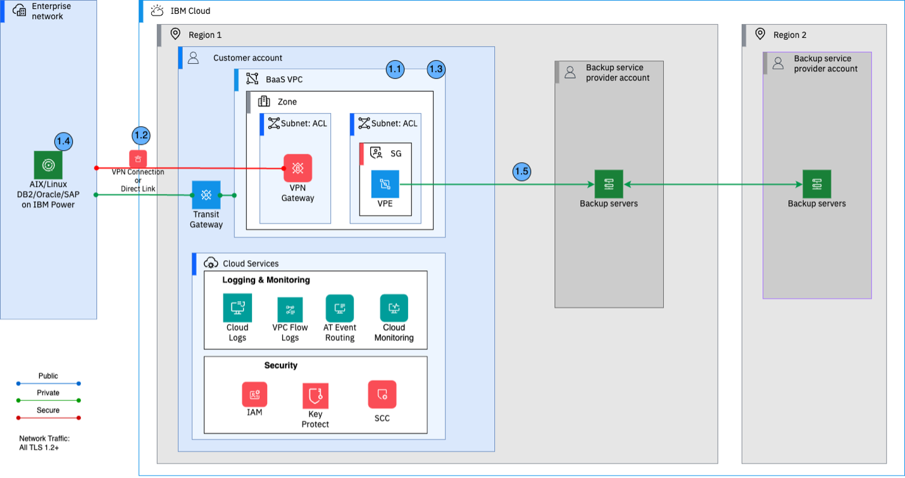

1. Create project:
To use the DA, you can either use trusted profile or API key. To create Trusted Profile, login to IBM Cloud and create a project first.
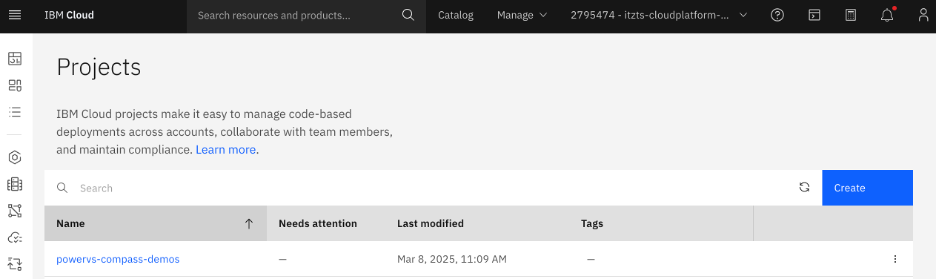

Note the CRN of the project from the Manage tab:
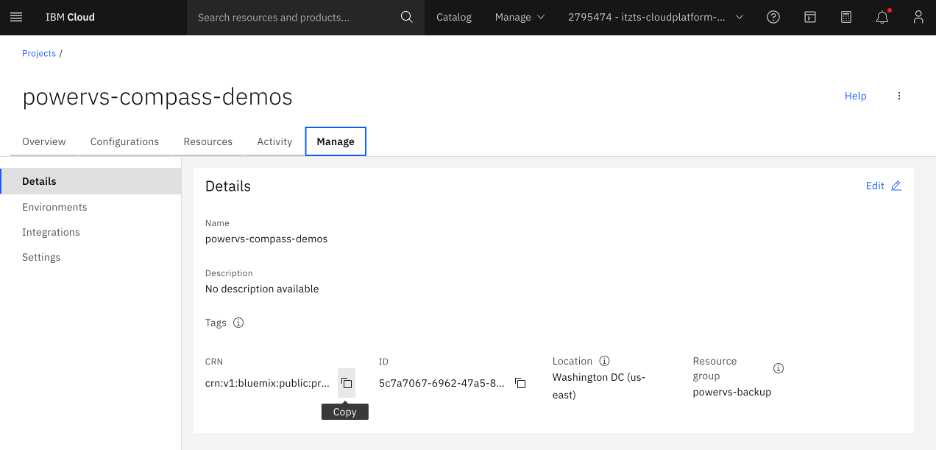

2.	Create Trusted profile
To create a trusted profile, click on Manage-> Access (IAM) -> Trusted profiles, and click on the Create button. 
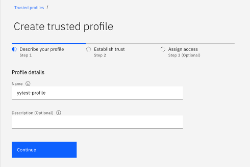

Fill in profile name, and choose IBM Cloud services:
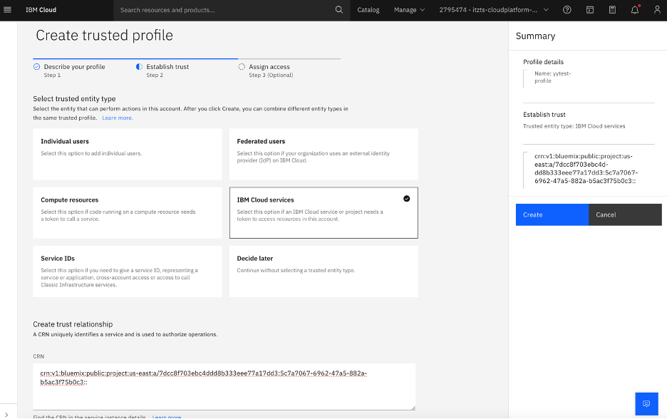

Once the Trusted profile is created, grant access on the Access tab. Add the access group with the right permission. 
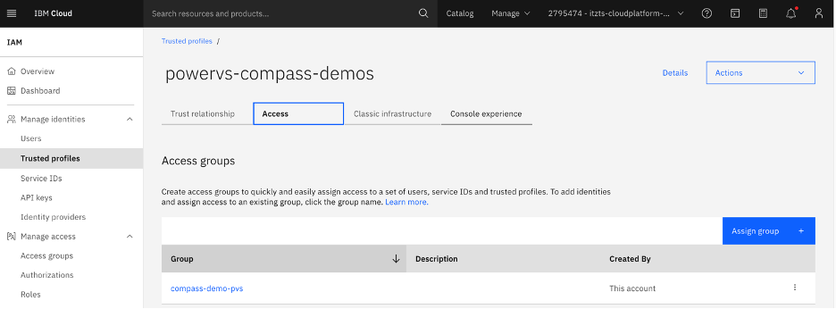

Click on Details on the upper right, and note down the Profile ID.
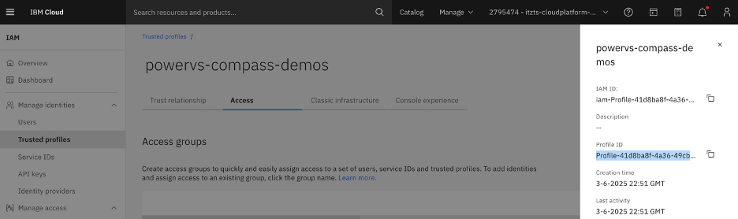

3.	Run PowerVS QuickStart DA
Search for ‘Power Virtual Server with VPC landing zone’ in the Catalog. 

Use PowerVS Quickstart deployable architecture (DA) to create a new architecture. You can set up PowerVS instance with AIX, IBM i, Linux, or SAP. In this demo, we will set up a new architecture with RHEL 9.2 on PowerVS instance. [Detailed instructions](https://cloud.ibm.com/docs/powervs-vpc?topic=powervs-vpc-deploy) can be found in IBM Cloud docs.

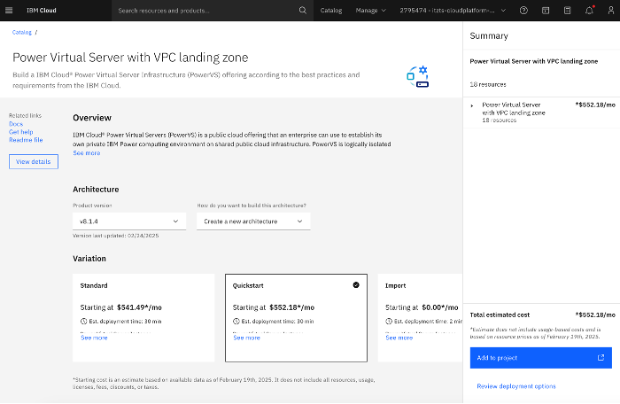

4. Add to an existing project. 

5. Let’s create a Linux virtual server with RHEL 9.2 image. We can choose custom image for ‘tshirt_size’ and choose ‘Linux -RHEL9-SP2’ for ‘custom_profile_instance_boot_image’ under optional parameters. For ‘custom_profile’ field, here is the sample input for a small virtual server, you can adjust the input based on your requirements.
{
  "sap_profile_id": null,
  "cores": "1",
  "memory": "2",
  "server_type": "s922",
  "proc_type": "shared",
  "storage": {
    "size": "",
    "tier": ""
  }
}
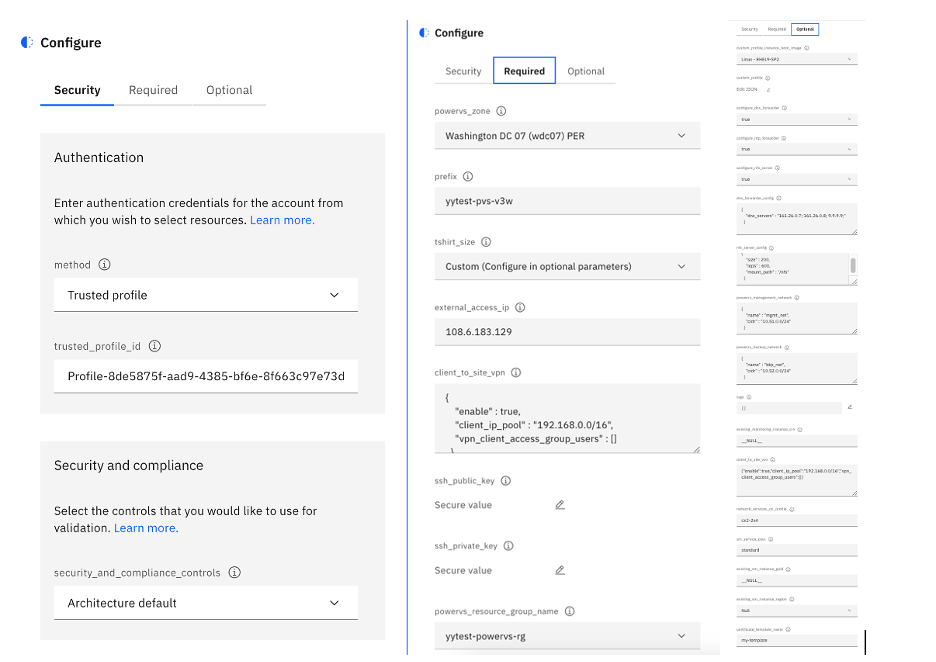

6. Save and validate the configuration. Approve and deploy. The environment will be deployed automatically. 
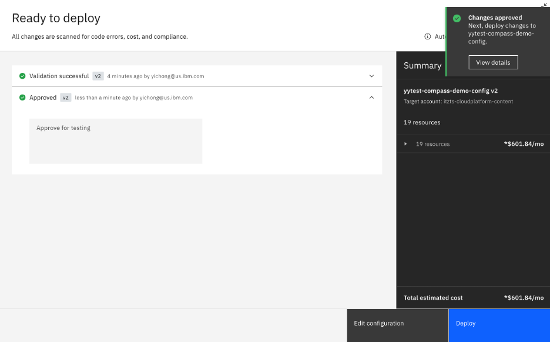

7. As you can see from the deployable architecture diagram, it creates Edge VPC and PowerVS workspace. In Edge VPC, it creates Bastion host (jump server) in management security group, and proxy server in network service security group. It also creates a PowerVS instance in the PowerVS workspace with RHEL 9.2. Other necessary components to connect PowerVS workspace with IBM Cloud resources and secure the environment are also created, for example, Transit Gateway, VPN, VPE, etc.

**PowerVS Quickstart post setup**

1. Once the environment is created, go to the Outputs tab of the configuration, and you can find IPs needed to make the connection to the environment.
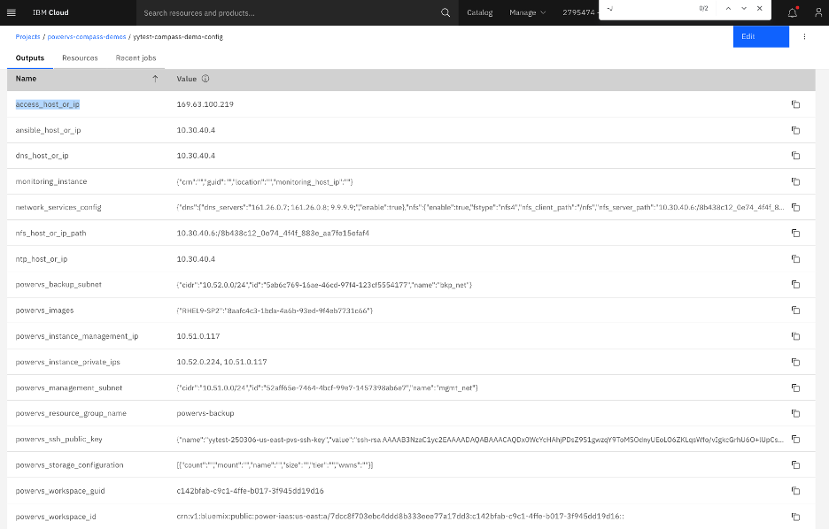

2. Note down the following information:
•	access_host_or_ip – The floating IP of the jump server that you can access remotely.
•	powervs_instance_management_ip – The private IP of the PowerVS instance that you can access from jump server.
•	proxy_host_or_ip_port – Proxy server.

To access the jump server, I added the following in ~/.ssh/config on my local Mac.

Host pvs_compass_jumpserver
    HostName access_host_or_ip
    user root
    IdentityFile ~/path_to_my_private_key
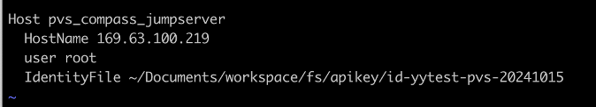

3. The following command should allow you to ssh to jump server from your local machine.

- ssh pvs_compass_jumpserver 

4. And the following ssh with ‘-J’ option should allow you ssh to the PowerVS instance via the jump server from your local machine. Refer to ssh manual page for more details.

 - PVS_SERVER_IP= powervs_instance_management_ip
 - ssh -i PRIVATE_KEY_FILE -J root@pvs_compass_jumpserver root@$PVS_SERVER_IP
 

5. Login to the PowerVS instance, and follow the Quickstart next steps to allow the PowerVS instance to access internet and mount nfs drive.

- Configure the proxy to reach the internet. You can add the proxy settings in ~/.bashrc. As mentioned in the documentation, find the <proxy_host_or_ip_port> value in the output section of the deployment, and add the following entries at the end of /.bashrc file.
export http_proxy=http://<proxy_host_or_ip_port>:3128
export https_proxy=http://<proxy_host_or_ip_port>:3128
export HTTP_PROXY=http://<proxy_host_or_ip_port>:3128
export HTTPS_PROXY=http://<proxy_host_or_ip_port>:3128
export no_proxy=161.0.0.0/0,10.0.0.0/8

6. You can run ‘souce .bashrc’ to load the new settings, and now the PowerVS instance should have internet access. You can try to connect to external site.
curl google.com
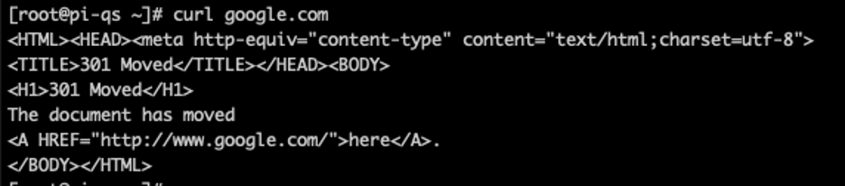

7. Mount file storage from VPC on PowerVS instance. For Linux, run the following commands.
mkdir /nfs
mount <nfs_host_or_ip_path> /nfs
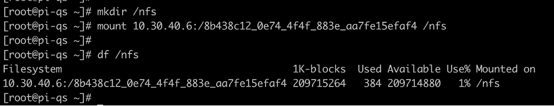

8. Config DNS on PowerVS instance
Add the dns_host_or_ip_path value at the top in the /etc/resolv.conf file
  nameserver dns_host_or_ip
  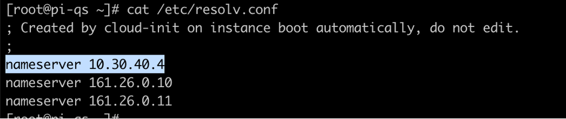

**Put content on PowerVS instance**

1. Now we have PowerVS environment set up, we can deploy some contents on the PowerVS instance. 

For example, create a sample test file:
  - Create a sample test file
echo "IBM Power Virtual Server is a family of configurable, multi-tenant, virtual IBM Power servers with access to IBM Cloud services." > mytest.txt

Or optionally set up some sample workloads, for example, deploy MySQL server. You can install MySQL on RHEL 9.x by following instructions on this [Red Hat documentation page.](https://docs.redhat.com/en/documentation/red_hat_enterprise_linux/9/html/configuring_and_using_database_servers/ssembly_using-mysql_configuring-and-using-database-servers#installing-mysql_assembly_using-mysql)
 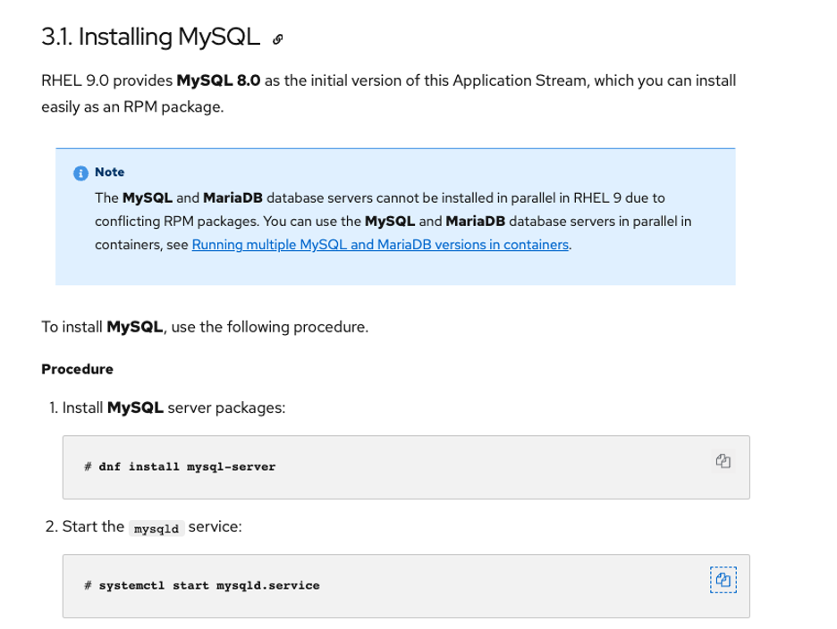

 2. You can also set up a sample database by following instruction on MySQL documentation page.
 
   - Download the zip file for the test_db on local machine

   - Securely copy the file to the PowerVS instance

 scp -i $MY_PRIVATE_KEY -J root@pvs_compass_jumpserver ~/Downloads/test_db-master.zip root@$PVS_SERVER_IP:/root/test_db-master.zip
   - Login to PowerVS instance and install unzip.

 dnf install unzip
  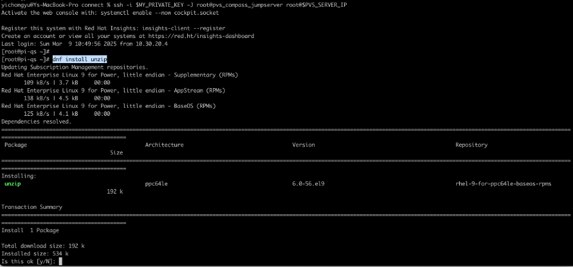

  3. Install the sample DB
  unzip test_db-master.zip
  cd test_db-master
  mysql -t < employees.sql
  
    - Validate the database by following instructions here.
  time mysql -t < test_employees_sha.sql
  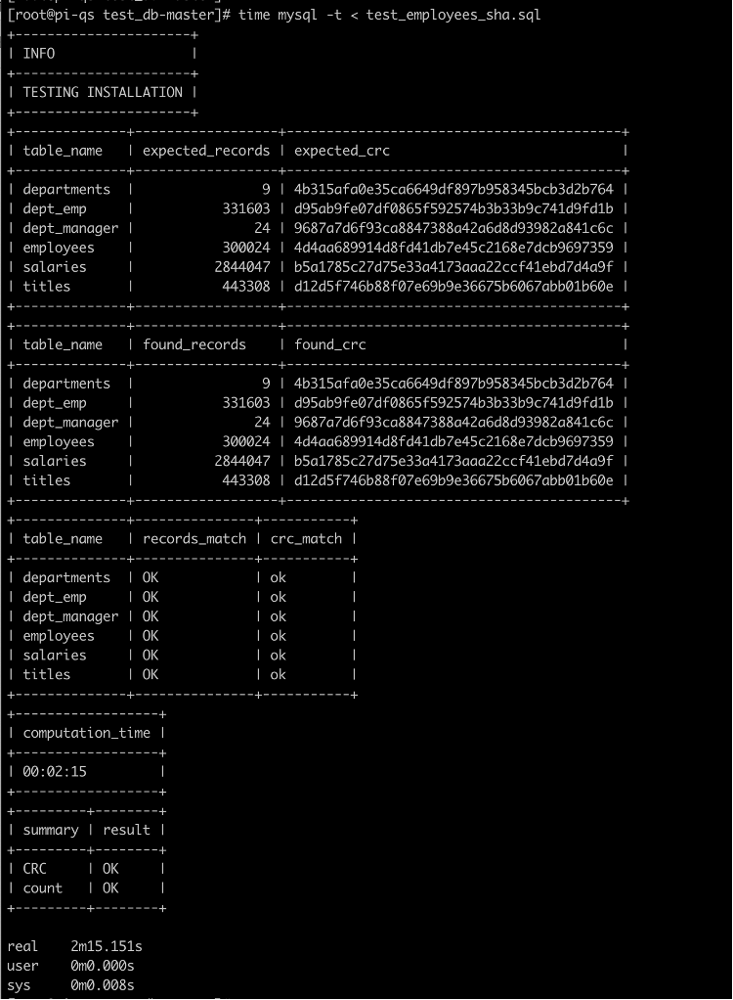

  4. You can also run a few SQL statements to query the database.
   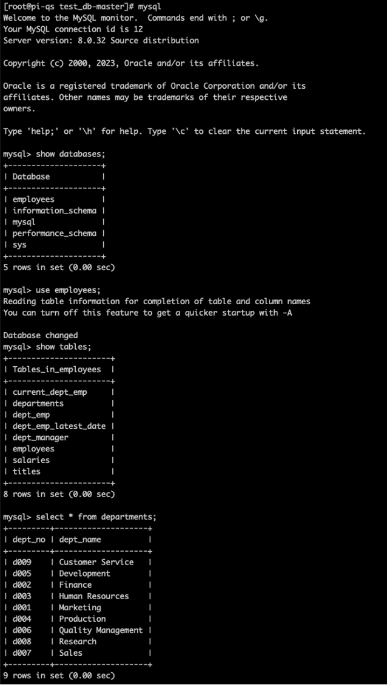
 
 5. For some databases, for example, Oracle, Compass integrates with the database via RMAN and you need to run another installer on the virtual server. For MySQL, user could backup the database into a file, for example:
  - Backup MySQL locally
 mysqldump -p <database_name > <backup_file.sql>
 

 Now we have the PowerVS instance and some sample data ready, we can start the backup.

 **Post Deploy steps**

 1. Once the environment is created, go to the Outputs tab of the configuration, and you can find IPs needed to make the connection to the environment.
 

 2.	Note down the following information:
 •	access_host_or_ip – The floating IP of the jump server that you can access remotely.
 •	powervs_instance_management_ip – The private IP of the PowerVS instance that you can access from jump server.
 •	proxy_host_or_ip_port – Proxy server.
 
 3.	To access the jump server, I added the following in ~/.ssh/config on my local Mac.
 
 Host pvs_compass_jumpserver
     HostName access_host_or_ip
     user root
     IdentityFile ~/path_to_my_private_key
  

  4. The following command should allow you to ssh to jump server from your local machine.
    - ssh pvs_compass_jumpserver 
    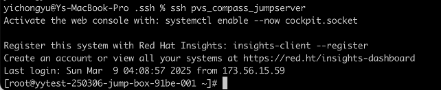

  5.	And the following ssh with ‘-J’ option should allow you ssh to the PowerVS instance via the jump server from your local machine. Refer to ssh manual page for more details.
    - PVS_SERVER_IP= powervs_instance_management_ip
    - ssh -i PRIVATE_KEY_FILE -J root@pvs_compass_jumpserver root@$PVS_SERVER_IP
    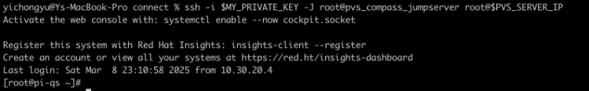

  6.	Login to the PowerVS instance, and follow the [Quickstart next steps](https://cloud.ibm.com/docs/powervs-vpc?topic=powervs-vpc-solution-quickstart-next-steps) to allow the PowerVS instance to access internet and mount nfs drive.
  
    - Configure the proxy to reach the internet. You can add the proxy settings in ~/.bashrc. As mentioned in the documentation, find the <proxy_host_or_ip_port> value in the output section of the deployment, and add the following entries at the end of /.bashrc file.
  export http_proxy=http://<proxy_host_or_ip_port>:3128
  export https_proxy=http://<proxy_host_or_ip_port>:3128
  export HTTP_PROXY=http://<proxy_host_or_ip_port>:3128
  export HTTPS_PROXY=http://<proxy_host_or_ip_port>:3128
  export no_proxy=161.0.0.0/0,10.0.0.0/8
  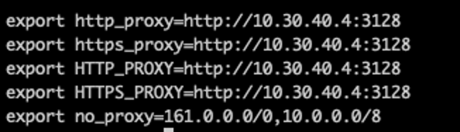

  7. You can run ‘souce .bashrc’ to load the new settings, and now the PowerVS instance should have internet access. You can try to connect to external site.
  curl google.com
   

  8. Mount file storage from VPC on PowerVS instance. For Linux, run the following commands.
   mkdir /nfs
   mount <nfs_host_or_ip_path> /nfs
    

  9. Config DNS on PowerVS instance
  Add the dns_host_or_ip_path value at the top in the /etc/resolv.conf file
    nameserver dns_host_or_ip
   
  
  
 

### Learning resources

[Cloud docs for Red Hat OpenShift AI](https://cloud.ibm.com/docs/openshift?topic=openshift-ai-addon-about&interface=ui)

[Red Hat Documentation for OpenShift AI](https://docs.redhat.com/en/documentation/red_hat_openshift_ai/2025)

### Contacts

**WW Tech Sales**

Jagan Dusi (dusij@us.ibm.com) - WW Technical Sales Leader, AI and Cloud native, IBM Cloud

Vivek Subramanian (vsubrama@us.ibm.com) - Executive Architect, Cloud Solutioning, - IBM Cloud

**Geo Tech Sales**

AMERICAS Leader – Jeff Greenberg (jgreenberg@us.ibm.com)

SME team - Tom Scott (tscott@us.ibm.com)

EMEA  Leader - Barry Brown (BARRYBRO@ie.ibm.com)

SME team - Lionel Mace (lionel.mace@fr.ibm.com)

AP Leader – Vamsi Mudiam (vamsi.mudiam@ibm.com)

Japan Leader – Hiroshi Kohno (HKOHNO@jp.ibm.com)

**Client Engineering**

[WW contacts](https://w3.ibm.com/w3publisher/client-engineering/team)

**Product Management:**

Darrel Schrag (drschrag@us.ibm.com), Product Manager, ROKS/IKS

Su Agrawal (agrawals@de.ibm.com), Product Manager, Cloud Containers

Dave Tropeano (davetropeano@us.ibm.com), Program Director, Containers + AI + Distributed Cloud
